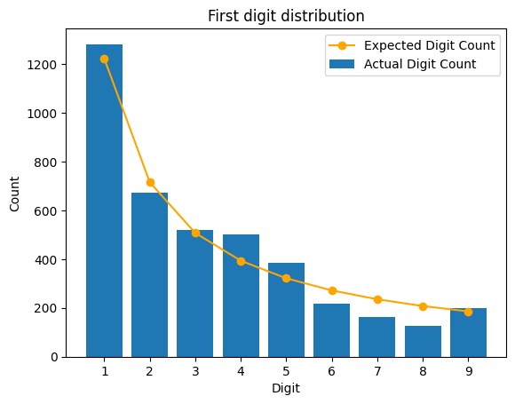
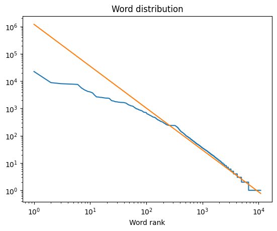

# Using power laws as an excuse to learn web scraping
When my wife and I go on a walk to Coolidge Corner, we ususally stop in at our favorite bookstore: Brookline Booksmith. When I'm there, I have a bad habit of
buying Math books from the discount non-fiction table which I typically stop reading after I hit 100 pages. This time around, for $8, I picked up [Grapes of Math](https://www.goodreads.com/book/show/13547287-the-grapes-of-math).

The book outlines some interesting patterns in nature and the math that describes them. One night, the author reminded me of two empirical laws which seem too bizzarre to be real: [Zipf's Law](https://www.wikiwand.com/en/articles/Zipf%27s_law) and [Benford's Law](https://www.wikiwand.com/en/articles/Benford%27s_law). I first encountered these laws in this [Vsauce video](https://www.youtube.com/watch?v=fCn8zs912OE) from 2015, around the same time when I started my undergraduate degree in Physics and began learning about power laws. I won't go into great detail to explain these laws here - for that, I recommend watching that video. However, revisiting this topic got me thinking...

>Are there naturally occurring datasets that *I* interact with often, which are Zipfian/Benfordian? 

I'm currently a Quality Engineer at MathWorks, supporting the [Sensor Fusion and Tracking Toolbox](https://www.mathworks.com/help/fusion/index.html). I've been meaning to learn how do web scraping so I set off to investigate just how Zipfian and Benfordian the documentation for our toolbox is!

## The Experiment
After a little bit of reading, it became clear that the most popular tool for this job is [Playwright](https://playwright.dev/python/). Now technically Playwright is advertised as a tool for automated testing for web applications. However, you can also use it to read in contents of web pages and understand the hierarchical structure of a website.

So the setup is simple:
1. Start with the landing page for our documentation
2. Iterate over all subpages, extracting the contents of each page
3. Save off the contents into a series of text files
4. Analyze the text in those files!

## The Results
### Adherance to Benford's Law
We'll start with a look at Benford's Law, since it is a bit simpler. This law predicts that for any naturally occuring dataset, the leading digit of all numbers in that dataset is likely to be small. How likely is determined by the following distribution:
$$P(d) = log10(1 + \frac{1}{d})$$

Where $P(d)$ is the probability of the leading digit of a number in the dataset being some digit $d$ (bounded from 0-9). Numerically, this looks like:
| d | P(d)|
|:---|:---|
|1| 30.10%|
|2| 17.61%|
|3| 12.49%|
|4| 9.69%|
|5| 7.92%|
|6| 6.69%|
|7| 5.80%|
|8| 5.12%|
|9| 4.58%|

It's worth pausing for a moment to think about the dataset that we're analyzing here. In our documentation pages, the numbers that you'll find fall into a few categories:
1. Dates at the bottom of each page for the MathWorks copyright (1994 - 2026)
2. Some common numbers used to tune parameters for Sensor Fusion and Tracking Toolbox features. For example, 30 is typically used as the default value for [AssignmentThreshold](https://www.mathworks.com/help/fusion/ref/trackergnn-system-object.html#mw_3c48d097-c7d1-4e64-b006-a0d4ab4b924e) for many of our trackers.
4. Numbers used in examples like [this one](https://www.mathworks.com/help/fusion/ug/air-traffic-control.html) to define the parameters that give our tools grounding in the real world like the `RangeResolution` for a radar sensor.

So perhaps there will be a bias towards leading digits for default values like 3 for `AssignmentThreshold`. Or perhaps there are some example parameters which appear very often across our documentation pages like the Latitude, Longitude, and Altitude for Logan Airport (`[42.366978, -71.022362, 50]`).
 
#### The Results
So how closely does our documentation adhere to Benford's Law? To analyze this we extract all of the numbers from the raw text of each web page, then extract the first digit of each of those numbers. We plot a histogram for the occurrence of each leading digit, and overlay the expected digit count. This expected count is computed as:
$$E(d) = N * P(d)$$

where $N$ is the total amount of numbers found in our dataset. Here are the results:

By the eye-test, our distribution follows Benford's law pretty closely! Slight deviations are natural in real datasets, but how much deviation is too much to consider your dataset no longer adherent to a natural law? For this, we can leverage some common statistical tests:
1. Chi-squared Test
2. Mean Absolute Deviation (MAD) Test

I was originally going to go with a simple Chi-squared test since this is what I'm familiar with from undergrad. However, some quick Googling told me that MAD is a more common and reliable statistical test for Benford's law adherance since it is sample-size independent. Chi-squared tests can be sensitive to large datasets where small deviations begin to become statistically significant.

A MAD test checks the average deviation of observations against their expected values, and is computed as:
$$\text{MAD} = \frac{\sum_{i=1}^{K} |O_i - E_i|}{K}$$

Where $O_i$ represents the observation for some digit $i$ and $E_i$ is the expected value for that same digit. For our use case, $K = 9$ since we're only considering digits 1-9.

Dr. Mark Nigrini in his book "Benford's Law: Applications for Forensic Accounting, Auditing, and Fraud Detection", poses the following thresholds for conformity to Benford's Law **for forensic accounting**:

| Mean Absolute Deviation (MAD) Range | Conformity Level |
| :--- | :--- |
| 0.000 to 0.006 | Close conformity |
| 0.006 to 0.012 | Acceptable conformity |
| 0.012 to 0.015 | Marginally acceptable conformity |
| Above 0.015 | Non-conformity |

Our dataset has $\text{MAD} = 0.0137$ which falls into the "Marginally acceptable" range for MAD which, at least to me, makes a lot of sense. Firstly, we're not doing any forensic accounting so these ranges are likely a bit strict to begin with for our acceptance criteria for technical documentation. I doubt the IRS is going to be auditing our documentation for cooking our books. And secondly, like we mentioned before, our dataset has some "human-injected" numbers which are often repeated (copyright dates, default values for certain parameters, physical constants) which are likely to skew the dataset. This analysis hasn't been done for this particular blog post, but I might come back and update this on a rainy day if I ever do a deep dive!

Again, it's worth pausing to challenge our assumptions. Are we just making excuses to make a cool-looking blog post with a nice checkmark at the end saying "Yay, we adhere to the law! Don't look over here at this ugly data which might say that we don't"? It is a somewhat subjective call to determine which MAD ranges constitute adherance to the law. However, since our dataset passes the eye-test and since these ranges are well-established for forensic accounting (where these ranges are pretty strict), I feel comfortable saying that:
 > Our dataset adheres to Benford's Law!
#### Future Work
While our dataset shows adherance to Benford's law, it also contains a large set of numbers which we haven't considered yet: those with 0 as the leading digit! Benford's law doesn't describe where these numbers should fall on the distribution.

Additionally, as mentioned before, there are *some* deviations from the law. It'd be interesting to see if there are any patterns which dominate to cause this deviation.

Finally, another practice which is followed to have a higher level of confidence when evaluating Benford's Law adherence is to evaluate the distribution of the **second** digit of each number in the dataset. Benford's Law describes that for increasing $N$ where $N$ is the location of the digit that we're analyzing in a number, the curve gets flatter and flatter, eventually approaching a uniform distribution.

### Adherance to Zipf's law
1. Analysis using a simple slope comparison
2. Using the Mandlebrot Refinement to explain the initial curve in the dataset. This is apparently a common thing.
3. A more naiive approach to (2) is zooming in on the first section and showing that it follows a different linear curve in the beginning, then is consistent for the tail - Probably leave this out
4. Show some of the top words. Notice that most of the top ones agree with the same top words the video!

